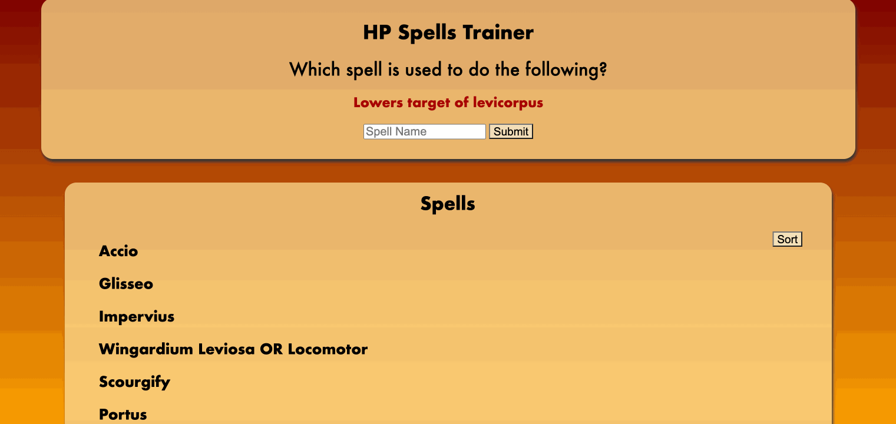
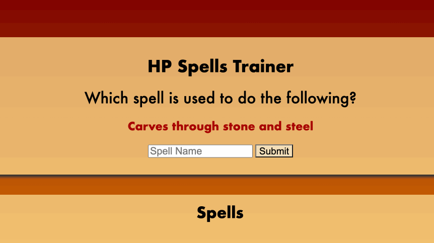
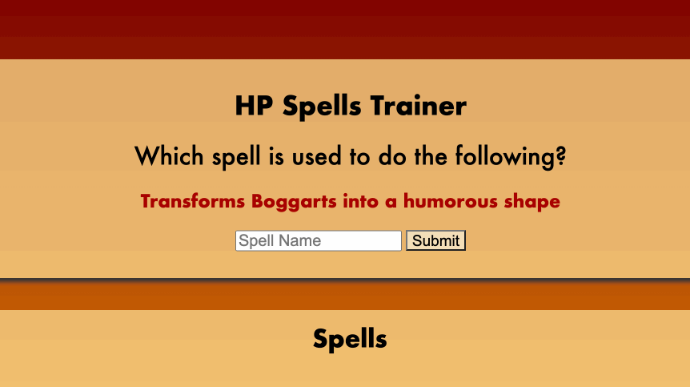
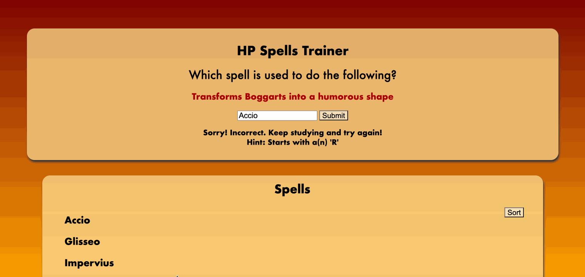
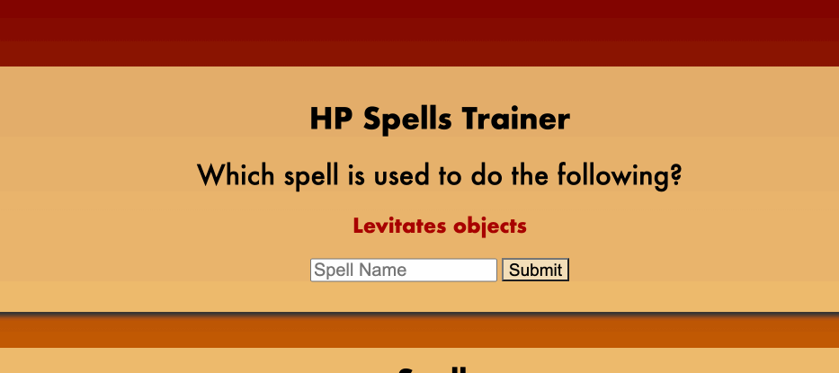

# HP Spells Trainer

>HP Spells Trainer is a memory test app for learning Harry Potter spells. The best way to become the best witch or wizard in the wizarding world is by making sure you have all of those spells memorized!

## App Philosophy

The target audience of this app is any Harry Potter fan who wishes to learn and memorize all of the spells and their uses performed throughout the Harry Potter book series. This app will help you gain that knowledge and also test you on what you learn.

## Features

- Can click a specific Harry Potter spell from a list of spells to view and hide their uses. This helps the user memorize which spells do what, like flash cards
- Can sort the list of spell names by alphabetical order
- Can retrive a random use of a spell and tests your knowledge by asking for the spell name that matches it
- Can change the color of a spell name by hovering over it with the mouse
- Can retrive the first letter that the spell starts with as a clue for when the answer entered is incorrect

## How to Use

1. Start by going down the list of names of spells on the page and by clicking each spell so that you can view and hide the use for each spell. Do this to memorize which spell does what. This list is fetched from the [Harry Potter API](https://fedeperin-harry-potter-api-en.herokuapp.com/)

 

2. After studying your spells, you can go to the top of the page and read the random use of a spell generated under the question, "Which spell is used to do the following?" At any point, you can click the random use generated so that a new random use is replaced with the current one



3. Enter the name of the spell that you think best matches that use and click submit
4. If the spell name is incorrect, you will get a message saying so, then a clue that gives you the first letter the spell name starts with



5. At this point you can scroll down, click the sort button and you can sort the spells by name to easier find the one that would start with that letter
6. Click each spell to reveal their uses until you find the one you need
7. Scroll up and enter the correct spell
5. If the spell is correct, you will get a message saying you've earned some points for your Hogwarts house



> ** In the case where the random use has two spell names, either of the two names will work.

>

## How to Run


On your terminal, change the current working directory to where you want the cloned directory to live. Copy the URL for this repository. Then type `git clone` into your terminal and paste the URL.

```bash
$ git clone https://github.com/guzdaniel/learn-spells-app.git
```

Change the current working directory to the directory you just cloned. Open `index.html` in a browser.
```
$ open index.html
```

## Technologies Used

This Single Page Application was made using:
- Vanilla Javascript
- [Harry Potter API](https://fedeperin-harry-potter-api-en.herokuapp.com/)
- HTML
- CSS


